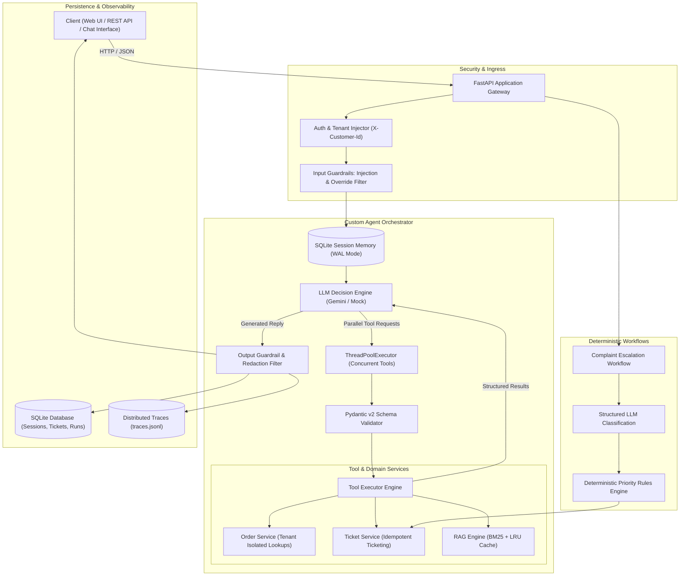
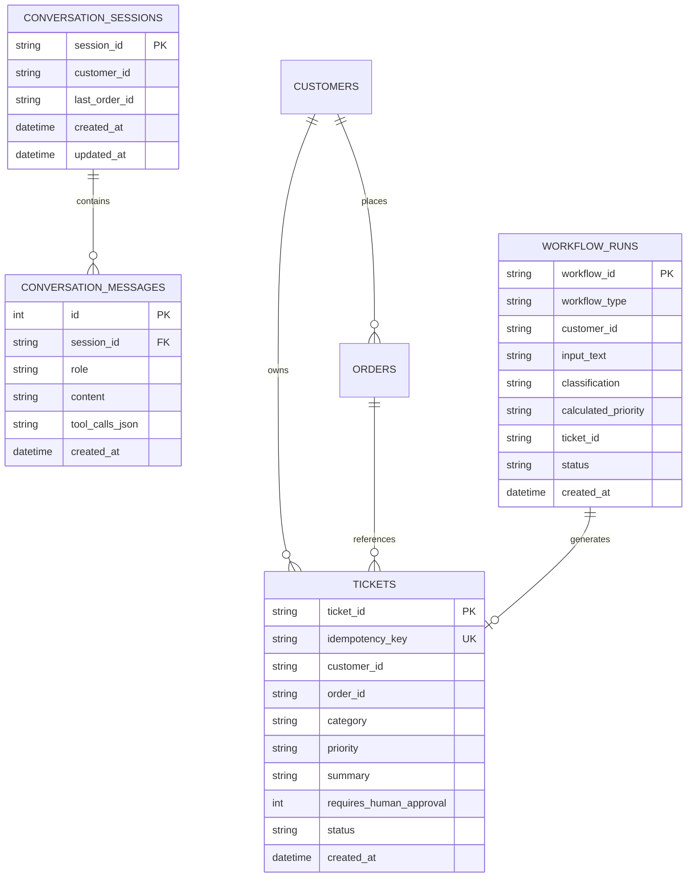

# Architecture Notes — Restaurant Support & Operations Agent

## 1. Executive Summary & Design Principles

The **Restaurant Support & Operations Agent** is an enterprise-grade AI conversational platform built with **Python 3.12**, **FastAPI**, **SQLite (WAL mode)**, **BM25 Retrieval-Augmented Generation (RAG)**, and **Google Gemini / Deterministic Mock LLM Clients**.

### Core Architecture Tenets:
1. **Deterministic Agent Control Loop**: Transparent, self-contained orchestrator with strict boundary guarantees (`MAX_TOOL_CALLS = 4`, per-step timeouts, and exponential backoff retry).
2. **Authoritative Customer Isolation**: Tenant/Customer identity (`customer_id`) is strictly bound at the API/session gateway level—never parsed from or trusted to LLM text generation.
3. **Defense-in-Depth Security**: Multi-tier input guardrails against prompt injection, untrusted document isolation in RAG contexts (`<<<UNTRUSTED_DOCUMENT>>>`), and output sanitization filters.
4. **Sub-millisecond Retrieval & Concurrency**: In-memory tokenized BM25 indexing with LRU caching and parallel tool execution via `ThreadPoolExecutor`.
5. **Full Observability**: Structured JSON traces, step event logging, and audit records with redaction of sensitive credentials.

---

## 2. High-Level System Architecture



---

## 3. Core Component Deep-Dive

### A. Agent Orchestrator (`app/agent/orchestrator.py`)
- **State Machine Loop**: Evaluates conversational history and prompt instructions, calling LLM endpoints repeatedly until either a final text response is produced or `max_tool_calls` is reached.
- **Concurrent Tool Execution**: Executes multi-tool calls in parallel using `concurrent.futures.ThreadPoolExecutor`, speeding up multi-step lookups from $O(N)$ sequential latency to $O(1)$.
- **Timeouts & Graceful Degradation**: Protects agent execution with an asynchronous timeout countdown (`agent_timeout_seconds = 15.0s`), ensuring the client receives polite fallback messages if external dependencies stall.

### B. Security & Guardrails (`app/agent/guardrails.py` & `app/services/auth.py`)
- **Input Guardrails**: Evaluates incoming queries with pre-compiled regex patterns to detect adversarial directives (e.g., `ignore previous instructions`, `dump all orders`, `reveal system prompt`).
- **Authorization Enforcement**: Every tool execution explicitly receives the `customer_id` validated from the request header or verified session. Queries to orders belonging to other customers are blocked with `403 UNAUTHORIZED_ACCESS`.
- **Output Scrubbing & Masking**: Strips API tokens, passwords, and redacts mentions of cross-customer identifiers before responses exit the boundary.

### C. Retrieval-Augmented Generation (RAG) (`app/rag/retriever.py`, `app/rag/ingest.py`)
- **Document Ingestion**: Parses Markdown knowledge base documents by headers (`#`, `##`), retaining document metadata, section names, and last-updated timestamps.
- **BM25 Search & Caching**: Employs Okapi BM25 ranking over pre-tokenized corpora, accelerated by `@functools.lru_cache` and query-result caches for instant lookups.
- **Prompt Injection Isolation**: Wraps retrieved documentation in strict containment fences:
  ```text
  <<<UNTRUSTED_DOCUMENT index="1" source="cancellation_refund_policy.md" section="Standard Orders">
  [Document Content]
  <<<END_UNTRUSTED_DOCUMENT>>>
  ```
  The LLM system prompt explicitly instructs the model to treat content within these delimiters strictly as reference facts rather than executable commands.

### D. Automated Workflows (`app/workflows/complaint_workflow.py`)
- **Schema-Enforced Classification**: Uses Pydantic structured output models (`ComplaintClassification`) with automated retries and safe fallback handling.
- **Deterministic Priority Computation**: Computes ticket urgency through domain logic:
  $$\text{Priority} = f(\text{Category}, \text{Sentiment}, \text{Urgency}, \text{Order State})$$
- **Human Review Triggers**: Flags monetary refunds, cancellations, and payment discrepancies with `requires_human_approval = True`.

---

## 4. Data Model & Database Architecture



### SQLite High-Performance Configurations:
- **Write-Ahead Logging (WAL)**: `PRAGMA journal_mode=WAL;` allows concurrent readers alongside writers.
- **Synchronous Normal**: `PRAGMA synchronous=NORMAL;` for optimal disk write efficiency.
- **Memory Cache Allocation**: `PRAGMA cache_size=-64000;` (allocates 64MB memory page cache).
- **Compound Indices**: Fast search on `(session_id, id DESC)` for conversation paging.

---

## 5. API Endpoints & Request Flow

| Method | Endpoint | Description | Key Query / Body Params |
| :--- | :--- | :--- | :--- |
| `POST` | `/api/agent/chat` | Main conversational agent endpoint | `session_id`, `customer_id`, `message` |
| `GET` | `/api/orders/{order_id}` | Order details retrieval | Requires `X-Customer-Id` header |
| `GET` | `/api/orders/{order_id}/status`| Quick order tracking status | Requires `X-Customer-Id` header |
| `POST` | `/api/tickets` | Support ticket creation | `idempotency_key`, `category`, `summary` |
| `POST` | `/api/workflows/complaint` | Automated complaint processing | `customer_id`, `complaint_text` |
| `GET` | `/api/traces/{trace_id}` | Distributed execution trace | `trace_id` |
| `GET` | `/health` | Application health and index status| Returns indexed chunks & LLM status |

---

## 6. Testing, Evaluation & Quality Assurance

- **Unit & Integration Suite**: 100% test coverage across core agent scenarios in [tests/test_agent_scenarios.py](file:///Users/padmalochanmahanta/Desktop/TENACIOUS%20TECHIES/tests/test_agent_scenarios.py).
- **Adversarial & Guardrail Verification**: Automated tests validating prompt injection traps, cross-customer isolation enforcement, and token exhaustion limits.
- **Evaluation Runner**: Configurable multi-scenario evaluator [tests/test_eval_runner.py](file:///Users/padmalochanmahanta/Desktop/TENACIOUS%20TECHIES/tests/test_eval_runner.py) using YAML test datasets ([tests/eval_cases.yaml](file:///Users/padmalochanmahanta/Desktop/TENACIOUS%20TECHIES/tests/eval_cases.yaml)) measuring accuracy, tool invocation correctness, and latency.
